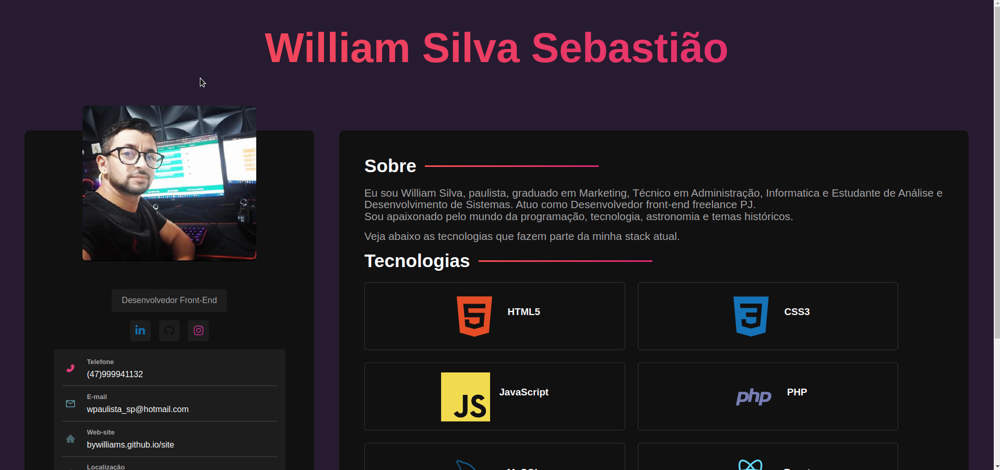

# 
Portofolio React + SASS 

Projeto feito com:
 - HTML, CSS -> SASS + Vite

O Intuito do projeto foi praticar SASS e alguns modules como o react0icons.
___

# Imagem da Aplicação
Agora será mostrado como ficou o projeto final.

&nbsp;

### Instalação
- Clone este repositorio atráves do terminal, VS Code 

## Autor

> William Silva -> [Site e portfolio pessoal](https://bywilliams.github.io/portfolio/)

**Agradeço por terem acompanhdo a documentação e a explicação deste pequeno projeto, e trarei mais projetos.**

